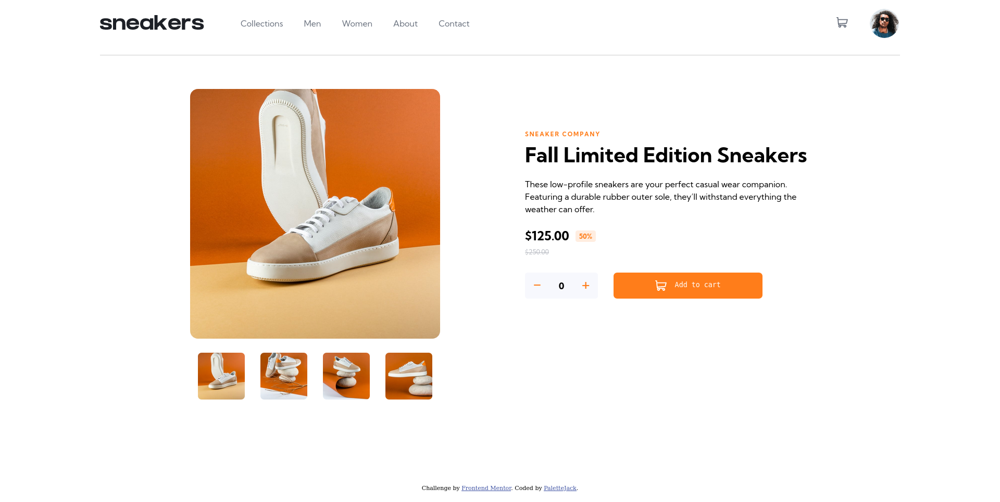

# FrontEnd Mentor E-Commerce page solution

Solution to the E-Commerce Challenge by FrontEnd Mentor made with Sveltejs

I like how this one turned out! It's not pixed perfect but I really liked how things ended up. I will have to refactor the code at some point, there's a lot of repeated lines but i'm overall happy with it. Svelte was also really fun to work with. I like the way svelte code is structured.